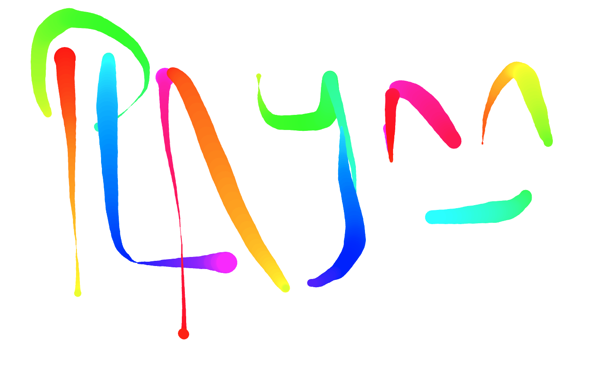

# Fun With HTML Canvas

## About

Fun with HTML5 Canvas is an interactive and vibrant project that lets you unleash your creativity on a digital canvas! This project leverages the power of HTML5 canvas to provide you with a playful environment where you can paint, draw, and experiment with colors in a rainbow palette.

*PS: After being inspired by Wes Bos' JAVASCRIPT30 course, I decided to follow it and build the Fun with HTML5 canvas to keep my hands dirty with JavaScript.*

## Table of contents

- [ Features ](#features)
- [ Demo ](#demo)
- [ Installation ](#installation)
- [ Usage ](#usage)
- [ Contributing ](#contributing)
- [ License ](#license)

## Features

- Canvas Playground Enjoy a digital canvas that serves as your creative playground. It's a blank space waiting for your artistic touch.

## Getting Started 

Begin your journey with Fun with HTML Canvas by opening the app in your web browser. Once you're in, you can interact with the canvas and start to draw using the mouse.

## Demo

Here are the links to the live demo:

- [Live Demo Link](https://maha-magdy.github.io/pictures-and-potions-of-harry-potter-films/)

## Installation

To install the Fun with HTML canvas on your local machine, follow these steps:

- Clone this repository: `git clone [https://github.com/Maha-Magdy/fun-with-html-canvas.git]`
- Open the `index.html` file in your web browser

## Contributing

Contributions, issues, and feature requests are welcome!

Feel free to check the [issues page](https://github.com/Maha-Magdy/fun-with-html-canvas/issues).

## Acknowledgments

- <a href="https://javascript30.com/">JAVASCRIPT30 course</a> for Wes Bos

## License

This project is [MIT](./LICENSE) licensed.

## Show your support

Give a ⭐️ if you like this project!
